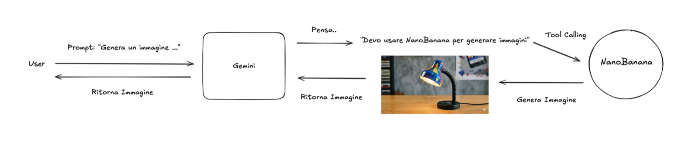

## Overview

Last 14th of May I went back to the University of Florence to give a seminar titled *"From LLMs to Agents"* 🤗. These notes are made on top of my [seminar slides](docs/seminar.pdf) - the deck also covers agentic Document AI at the end, which I am leaving out here to keep this post about one thing only.

Let's start with a fact that is easy to miss: the chat models we use nowadays are **not** the first ChatGPT. Under the hood they are still Large Language Models, they still work with language and they still predict one token at a time. But the thing you are talking to has grown a few extra habits: it can *reason* before answering, it can *call tools*, and it can speak [MCP](https://www.andreagemelli.me/posts/mcp/) to discover tools it has never seen before.

The clearest example of this is one you have probably already used without noticing: **image generation**.


*From the seminar slides: the user asks Gemini for an image; Gemini thinks "I need NanoBanana to generate images", calls it as a tool, and hands the returned picture back to the user.*

When you ask Gemini (or ChatGPT, or Claude) for a picture, *the model you are chatting with does not draw anything*. It is a language model: all it can produce is text. What actually happens is that it writes a **tool call** - a small, structured piece of text saying "run the image generator with this prompt" - and a completely different model, an image generator, does the drawing. The picture comes back into the conversation, and the chat model hands it to you as if it had been its own doing 🪄

Two models, one conversation. Once you see it, you see it everywhere: web search, code execution, file reading, sending an email. The chat client is an *orchestrator* around a model that only knows how to write text.

Why the detour? Because LLMs are limited by design, and the seminar spent a good part of Part 01 on this:

- **outdated information**: knowledge is frozen at training time;
- **no exact computation**: they happily hallucinate `273 x 1849`, or how many `r` are in *strawberry*;
- **no long-context planning**: no memory across calls, one forward pass at a time;
- **limited by language**: no way to interact with the *world*.

And one more property that is the key to everything that follows: **LLMs are stateless**. The "chat" you experience is simulated. Every time a new token is generated, the whole conversation is read again from the top. There is no hidden place where the model keeps things. So if you want the model to know something new - the result of a computation, today's weather, the content of a web page - there is exactly one way in: **put it in the context**.

That is, in one sentence, what a tool does.

## Agents & Tools

Let's borrow the definition from the [Hugging Face Agents Course](https://huggingface.co/learn/agents-course/unit1/introduction), Unit 1:

> "A system that leverages an AI model to interact with its environment in order to achieve a user-defined objective. It combines reasoning, planning, and the execution of actions - often via external tools - to fulfill tasks."

The course splits an agent in two parts, and I like the metaphor a lot:

- the **brain** is the LLM: reasoning, planning, deciding what to do next;
- the **body** is the set of tools: APIs, code execution, browsers. This is the agent's *capability space*.

An LLM without tools is a brain in a jar. It can describe the world beautifully and touch none of it.

### The ReAct loop

The canonical way to wire brain and body together is **ReAct** [^0], from Yao et al., 2022. The idea is deceptively simple: interleave *reasoning traces* and *actions*, so that thinking informs acting and observations inform thinking.

```python
while not done:
    thought = LLM(context)        # what to do next
    action = LLM(context)         # tool + arguments
    observation = tool(action)    # actually run it
    context += (thought, action, observation)
return final_answer
```

Three moves, repeated until the model emits a final answer:

- **Thought** - the LLM writes its reasoning as plain text (chain-of-thought);
- **Action** - the LLM emits a structured tool call;
- **Observation** - the *orchestrator* runs the tool and pastes the result back into the prompt.

Note who does what. The model never runs anything. It writes text that *looks like* a function call. Your code parses it, runs the real function, and appends the output to the conversation. Then the model reads everything again from the top - because it is stateless, remember - and decides the next move.

### Where a tool actually lives

A tool is not a special AI object. It is a normal function sitting in your codebase:

```python
from smolagents import tool

@tool
def get_weather(city: str) -> str:
    """Returns the current weather for a given city.

    Args:
        city: the name of the city, e.g. "Florence".
    """
    return requests.get(f"https://api.example.com/weather/{city}").json()["summary"]
```

The model never sees this code. What it sees is the *signature*, serialised into a schema:

```json
{
  "type": "function",
  "function": {
    "name": "get_weather",
    "description": "Returns the current weather for a given city.",
    "parameters": {
      "type": "object",
      "properties": {
        "city": {"type": "string", "description": "the name of the city, e.g. Florence."}
      },
      "required": ["city"]
    }
  }
}
```

and that schema is pasted, as text, into the system prompt. Here is a real one, taken from the [small reasoner I fine-tuned](https://huggingface.co/andreagemelli/Phi-3.5-mini-thinking-function_calling-V0) for this exact purpose:

```text
You are a function calling AI model. You are provided with function signatures
within <tools></tools> XML tags. You may call one or more functions to assist
with the user query. Here are the available tools:
<tools> [{'type': 'function', 'function': {'name': 'convert_currency', ... }}] </tools>
For each function call return a json object with function name and arguments
within <tool_call></tool_call> XML tags. Also, before making a call to a function
take the time to plan the function to take. Make that thinking process between
<think>{your thoughts}</think>
```

So: **the function lives on your machine, its description lives in the prompt**. Which means tool design is not prompt magic, it is ordinary software engineering - clear names, typed signatures, honest docstrings. That paragraph in the docstring *is* the interface the model programs against.

### Thinking is just more tokens

The last piece arrived with reasoning models. DeepSeek-R1 [^1] made this very visible: training R1-Zero purely with reinforcement learning, the authors describe an **"aha moment"** where the model spontaneously learns to stop, reconsider its approach and spend more tokens thinking before committing to an answer. Nobody taught it that step - it turned out to be worth reward.

The important consequence is compositional. If *thinking* is just tokens in the context, and a *tool call* is just tokens in the context, then the two compose for free. The model reasons about which tool it needs, emits the call, the tool **takes its own turn** in the conversation, and its output lands in the context like any other message. Then reasoning resumes with one more fact in hand.

### System 1 and System 2

This is where Kahneman shows up [^2]. In *Thinking, Fast and Slow*, System 1 is fast, intuitive, automatic - pattern matching with immediate output and no verification. System 2 is slow, deliberate, sequential - reasoning, checking, iterating.

A single LLM forward pass is System 1. It answers in one shot, from pattern, with no way to verify itself.

An agent - an LLM in a loop with tools - is System 2. It can plan, act, look at what came back, and change its mind. **The loop is what buys the deliberation**, and the tools are what make the deliberation about something real: they let the model *interact with an environment* rather than only describe it. And here is the part I insisted on with the students: that environment is exactly, and only, the set of tools you handed over. Nothing more.

Agency is not binary, though. It comes in levels, and most systems that people call "agents" sit lower on this ladder than the word suggests:

| Agency | Pattern | Example | Behavior |
|---|---|---|---|
| ★☆☆ | Router | `if llm_decides_a(): a() else: b()` | LLM picks a branch |
| ★★☆ | Tool caller | `run(llm_tool, llm_args)` | LLM picks tool + arguments |
| ★★★ | Multi-step agent | `while llm_should_continue(): step()` | LLM controls iteration |
| ★★★ | Multi-agent | `if llm_trigger(): spawn_agent()` | Agents spawn agents |

Most production agents live between ★★☆ and ★★★. More agency means more capability *and* more failure modes - a lesson everyone learns the expensive way at least once 🙃

## Practical examples: ask grandma about super good recipes!

Enough theory. Brain and body can be built separately, so I built one of each 👩🏼‍🍳

### A brain: a small model that thinks, then calls

The first artifact is [**Phi-3.5-mini-thinking-function_calling-V0**](https://huggingface.co/andreagemelli/Phi-3.5-mini-thinking-function_calling-V0): `microsoft/Phi-3.5-mini-instruct` fine-tuned with SFT (TRL) on [`Jofthomas/hermes-function-calling-thinking-V1`](https://huggingface.co/datasets/Jofthomas/hermes-function-calling-thinking-V1). It is the bonus exercise of Unit 1 of the Agents Course, which uses Gemma - I did it with Phi instead, which meant adapting the chat template and the special tokens, and that is where you actually learn something.

Ask it to convert 500 USD to Euros and this is what comes out:

```text
<think> Okay, so the user is asking to convert 500 USD to Euros. I need to figure out
which function to use. Looking at the available tools, there's a function called
convert_currency that does exactly that. It requires the amount, the currency to
convert from, and the currency to convert to. [...] </think>

<tool_call>
{'name': 'convert_currency', 'arguments': {'amount': 500, 'from_currency': 'USD', 'to_currency': 'EUR'}}
</tool_call>

<tool_response>
{'converted_amount': 425.5, 'from_currency': 'USD', 'to_currency': 'EUR'}
</tool_response>

Sure, 500 USD is approximately 425.50 Euros.
```

It is a toy model, and I am not pretending otherwise. But look at what it learned: not *how to convert currencies* - it never computed anything. It learned the **shape of the behaviour**: think first, emit a well-formed call, then stop and wait. The `425.5` came from outside the model entirely. The last sentence is the only part it wrote after reading the answer.

### A body: an agent that raids the internet for recipes

The second artifact is a full agent, [**grandma_secret_sauce**](https://huggingface.co/spaces/andreagemelli/grandma_secret_sauce) 🍝, built with [smolagents](https://github.com/huggingface/smolagents) and running as a Space. It has web search plus one custom tool of mine:

```python
@tool
def grandma_secret_sauce(url: str) -> str:
    """This tool look at the urls provided and returns the recipe from a working, existing page.
    Args:
        url: list of url pages to scrape the recipe from.
    """
    try:
        html = urlopen(url).read().decode("utf-8")
        scraper = scrape_html(html, org_url=url)
    except:
        return f"Recipe not found for provided url: {url}."

    ingredients = [f" - {ing}\n" for ing in scraper.ingredients()]
    return f"""
👩🏼‍🍳 Et voilà! The {scraper.title()}!
Preparation requires {scraper.total_time()} minutes, and it is for {scraper.yields()} people.

🧂 Ingredients:\n
{''.join(ingredients)}
🥘 Instructions:
{scraper.instructions()}
"""
```

and the agent itself is about ten lines:

```python
agent = CodeAgent(
    model=model,
    tools=[final_answer, DuckDuckGoSearchTool(), grandma_secret_sauce],
    max_steps=10,
    prompt_templates=prompt_templates,
)
```

Note the family: `CodeAgent` is a **code agent** - instead of emitting JSON, the model writes actual Python that gets executed in a sandbox. It is the second of the two styles, the first being the JSON tool-calling of the OpenAI / Anthropic / Gemini APIs. Same idea, different serialisation.

Ask it *"I have eggs, guanciale and pecorino, what do I cook?"* and the ReAct loop runs for real: search the web → get some URLs → call `grandma_secret_sauce(url)` on the most promising one → get back a structured recipe → `final_answer`. If the page is not a recipe page, the tool returns the string `"Recipe not found for provided url: ..."`, which is *not* a crash - it is just another observation. The agent reads it and tries the next link 🔁

And here is the punchline of the whole seminar, hiding in that tool: **none of the recipe knowledge is in the weights**. It is in [`recipe-scrapers`](https://github.com/hhursev/recipe-scrapers), a plain Python library. The model's entire contribution is deciding *which function to run, on which URL, and when to stop*.

One practical hint I gave the students, and I stand by it: use **Pydantic** for outputs and a linter like **ruff** on your tools. Verifiable types and well-formed docstrings are not hygiene here, they are the API your model is coding against.

## Conclusions

Three things to take home 🎓

1. **LLMs predict the next token.** Extremely capable, but stateless and, on their own, toolless. The chat is simulated; the context is the only memory there is.
2. **Agents = LLM + loop + tools.** That is what turns System 1 into System 2: the loop buys deliberation, the tools buy an environment to deliberate about.
3. **The interesting engineering is at the boundary**, not in the prompt. Which functions you expose, what you name them, what you write in the docstring, and what you feed back into the context. The model chooses; your code does.

If you want the full deck, agentic Document AI included, it is [here](docs/seminar.pdf). And if you want to argue with a language model about carbonara, [my grandma is available](https://huggingface.co/spaces/andreagemelli/grandma_secret_sauce) 🍝

Happy learning 🤗

## References

[^0]: Yao, et al., "ReAct: Synergizing Reasoning and Acting in Language Models", [arXiv:2210.03629](https://arxiv.org/abs/2210.03629), 2022
[^1]: DeepSeek-AI, "DeepSeek-R1: Incentivizing Reasoning Capability in LLMs via Reinforcement Learning", [arXiv:2501.12948](https://arxiv.org/abs/2501.12948), 2025
[^2]: Kahneman, "Thinking, Fast and Slow", 2011
