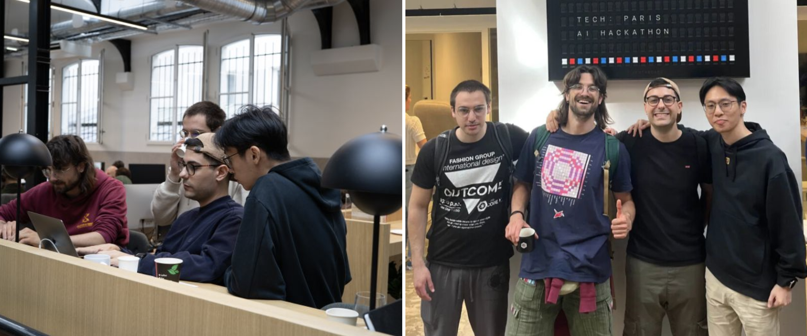

## Introduction

If you've been following the evolution of API development and AI integration, you've likely encountered two important but fundamentally different approaches: **OpenAPI** and **MCP (Model Context Protocol)** 🤖. While they might seem similar at first glance—both deal with connecting systems and enabling integrations—they serve very different purposes in today's tech landscape.

## OpenAPI vs MCP

### What is OpenAPI? 📋

OpenAPI (formerly known as Swagger) is a specification for describing REST APIs that defines a standard, programming language-agnostic interface description for HTTP APIs. Think of it as a universal language that tells developers exactly how to interact with an API—what endpoints are available, what data to send, and what to expect in return 💬.

The [OpenAPI Initiative](https://www.openapis.org/) maintains this open standard, with comprehensive documentation available at [spec.openapis.org](https://spec.openapis.org/oas/v3.1.1.html) and learning resources at [learn.openapis.org](https://learn.openapis.org/).

Here's a simple OpenAPI specification example:

```yaml
openapi: 3.0.0
info:
  title: Weather API
  version: 1.0.0
paths:
  /weather:
    get:
      summary: Get current weather
      parameters:
        - name: city
          in: query
          required: true
          schema:
            type: string
      responses:
        '200':
          description: Weather data
          content:
            application/json:
              schema:
                type: object
                properties:
                  temperature:
                    type: number
                  condition:
                    type: string
```

This specification tells any developer (or tool) exactly how to fetch weather data from this API. It's documentation, validation, and a contract all rolled into one ✅.

### Enter MCP: Model Context Protocol ⚡

MCP represents a newer paradigm designed specifically for AI agents and language models. [Introduced by Anthropic in November 2024](https://www.anthropic.com/news/model-context-protocol), MCP creates a standardized way for AI systems to interact with external tools and data sources. As described in the [official MCP documentation](https://modelcontextprotocol.io/introduction), it serves as "a USB-C port for AI applications" 🔌.

The key difference? **OpenAPI describes how humans (or their applications) should call APIs, while MCP describes how AI agents should access and use tools** 🎯.

MCP has gained rapid adoption across the industry, with [major AI providers including OpenAI and Google DeepMind adopting the protocol](https://en.wikipedia.org/wiki/Model_Context_Protocol) 🌟. The [MCP specification](https://modelcontextprotocol.io/specification/2025-03-26) provides comprehensive technical details for implementers.

Here's what an MCP tool definition might look like:

```javascript
// MCP Server Example
const server = new MCPServer({
  name: "weather-tools",
  version: "1.0.0"
});

server.addTool({
  name: "get_weather",
  description: "Get current weather for a city",
  inputSchema: {
    type: "object",
    properties: {
      city: {
        type: "string",
        description: "City name to get weather for"
      }
    },
    required: ["city"]
  },
  handler: async (args) => {
    // Fetch weather data
    return {
      temperature: 22,
      condition: "sunny",
      city: args.city
    };
  }
});
```

### When to Use Which? 🤔

**Choose OpenAPI when:**
- Building traditional web APIs for human developers
- Need broad ecosystem support and tooling
- Working with existing REST-based architectures
- Requiring detailed API documentation for teams

**Choose MCP when:**
- Building tools specifically for AI agents
- Want AI systems to discover and use capabilities dynamically
- Need context-aware, conversational interactions
- Developing in AI-first environments

## The Translation Challenge 🌉

Here's where things get interesting for developers: many existing systems have robust OpenAPI specifications, but to leverage AI agents effectively, we need MCP compatibility. This creates a translation problem—how do you bridge these two worlds?

Converting between OpenAPI and MCP isn't just about changing formats; it requires understanding the semantic differences:

```python
# OpenAPI endpoint
GET /users/{id}/orders?status=pending

# Might become MCP tool
{
  "name": "get_user_pending_orders",
  "description": "Retrieve pending orders for a specific user",
  "parameters": {
    "user_id": "string",
    "include_details": "boolean"
  }
}
```

The MCP version is more descriptive and context-aware, helping AI agents understand not just *how* to call the function, but *when* and *why* it might be useful 🧠.

### The Community Perspective 💬

The developer community has been actively discussing the implications of these two approaches. As one developer noted in a [DEV Community discussion](https://dev.to/duske/model-context-protocol-mcp-should-i-stay-or-should-i-go-3c9n): *"Having a stateful 1:1 mapped client-server connection like MCP defines it just to get the weather in a certain city is a bit of an overkill. And if it is just a small stateless REST API, providing an OpenAPI runner is good enough. But once you have a more complex use case that involves state or require a deep interaction between the LLM and the application, MCP can be a great fit."*

The conversation on social platforms reflects this pragmatic approach—developers are recognizing that both protocols have their place, with [discussions on LinkedIn](https://www.theproductled.com/p/plg-recap-ai-agents-and-mcp-edition) highlighting how "open, modular protocols like MCP lower friction, speed up experimentation and create the conditions for early network effects."

## Making the Translation Easy 🛠️

Converting between these specifications manually is time-consuming and error-prone. That's why we built **EasyMCP** ([EasyMCP on GitHub](https://github.com/remorses/easymcp)), a tool that automatically translates OpenAPI specifications to MCP format, making it simple for developers to bring their existing APIs into the AI ecosystem 🚀.

Our solution ranked 3rd 🥉 at the Paris AI Hackathon 🏆 organized by [TechEurope](https://blog.techeurope.io/p/hackathon-paris-1) and sponsored by big players such as HuggingFace, Mistral AI and ElevenLabs, demonstrating the real need for this kind of translation layer in today's rapidly evolving AI landscape.



## Looking Forward 🔮

Both OpenAPI and MCP will likely coexist, serving their respective ecosystems. OpenAPI continues to be the gold standard for human-to-system API communication, with its [extensive tooling ecosystem](https://openapi.tools/) and mature development practices. Meanwhile, MCP is emerging as the standard for AI-to-system integration, with Microsoft announcing [MCP support in Windows 11](https://blogs.windows.com/windowsexperience/2025/05/19/securing-the-model-context-protocol-building-a-safer-agentic-future-on-windows/) and [Copilot Studio integration](https://www.microsoft.com/en-us/microsoft-copilot/blog/copilot-studio/introducing-model-context-protocol-mcp-in-copilot-studio-simplified-integration-with-ai-apps-and-agents/).

The real opportunity lies in creating seamless bridges between these worlds—enabling organizations to leverage their existing OpenAPI investments while unlocking the power of AI-driven automation through MCP 🔗.

**Additional Resources:** 📚
- [OpenAPI Specification](https://spec.openapis.org/oas/v3.1.1.html) - Official specification
- [Model Context Protocol Documentation](https://modelcontextprotocol.io/) - Complete MCP guide
- [OpenAPI Tools](https://openapi.tools/) - Comprehensive tooling ecosystem
- [MCP GitHub Organization](https://github.com/modelcontextprotocol) - SDKs and reference implementations
