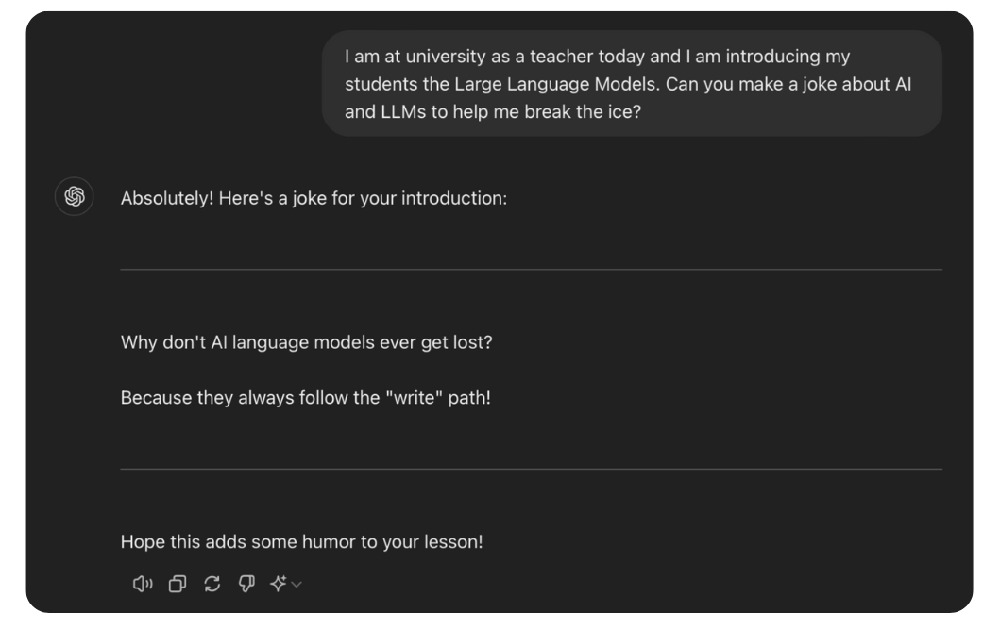
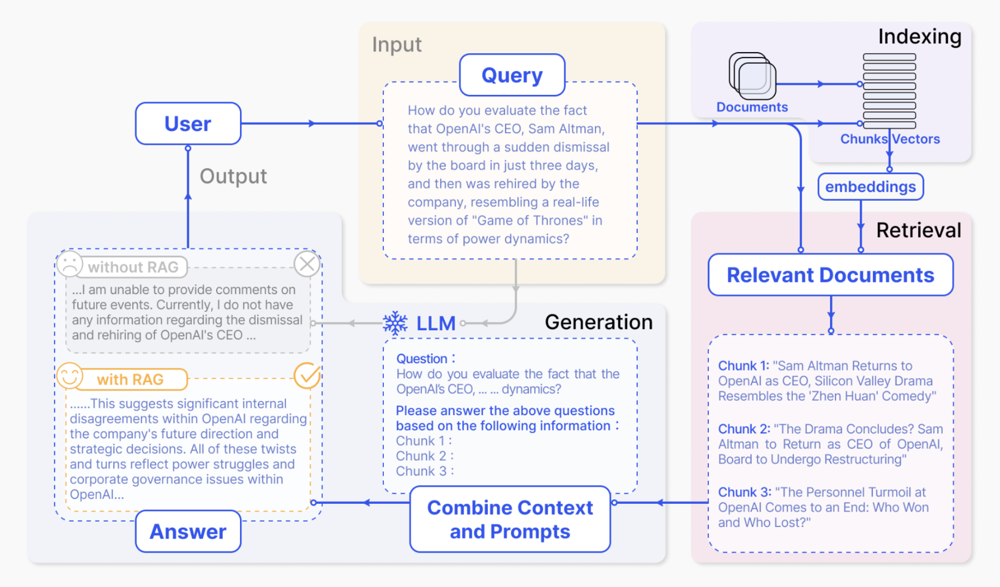

## Introduction

Recentely my PhD supervisor called me, asking: "Would you like to come to one of my lecture and present the students an use-case of yours? You choose!". Of course, as the avarage infamous PhD experience with supervisors, I could not say no 😂

Jokes aside, it has been not the first time I hold a lecture at the University of Florence about Natural Language Processing, but this time I wanted to talk about something kind of *new*: retrieval augmented generation (RAG). Another amazing acronym to make already known things look fancier and more cryptic. Let's delve (nah, this post it is not AI generated - chill) into the topic as I did with the students.

These notes are made on top of my [lecture slides](docs/lecture.pdf) and inspired by [Mistral blog post](https://docs.mistral.ai/guides/rag/).

## Super-uber fast transformer recap

Transformers are relatively new architectures [^0] that have revolutionized not only the world of research, from NLP to computer vision [^1], but also our daily lives. The secret of their success? Scaling [^2] [^3]. More parameters, more data and more GPUs going *brr*. Differently from RNNs or CNNs, transformers are quite more general architectures that, if fed with high volume of data, can approximate more complex patterns and distributions. Want to know more? A couple of videos I would suggest are:

- ["Attention is all you need"](https://www.youtube.com/watch?v=iDulhoQ2pro), by Kilcher;
- ["Let's build GPT: from scratch, in code, spelled out."](https://www.youtube.com/watch?v=kCc8FmEb1nY), by Karpathy.

Based on these architectures, nowadays we can use amazing closed-source models like ChatGPT and Claude by Anthorpic or open models like Le Chat by Mistral. Thanks to them, we can obtain more variate and hilarious jokes compared to the ones from Alexa, as shown below. This is due to the capability of these models to *generate* text, a.k.a. picking *tokens* from a finite set of possibilites, called vocabulary. (edit: I wrote about tokenizerss recently in another [blog post](https://www.andreagemelli.me/posts/tokenizers/) of mine. Check it out!)


*What an amazing world we live in.*

Everything seems fantastic so far, so what can go wrong?
Well, Large Language Models (LLM) may suffer of some "limitations":

- **outdated information**: trained on data up to X months/years ago;
- **hallucinations**: answering questions with different and unrelated answers seen at “some
point” during training;
- **limited knowledge**: data vary in time and things can change.

None of us have billions of dollars to retrain an LLM every day to prevent these limitations and also it would be very inefficient. Usually there are two solutions that can help the model "behave" as expected: either fine-tuning (read [this blog](https://www.philschmid.de/fine-tune-llms-in-2025) for more) or using Retrieval Augmented Generation (RAG).

## Let's prompt!

For the lecture, I [prompted](https://huggingface.co/chat/conversation/665f64d84f6689afa29b1b60) Mixtral [^4] with the following question: 

```python
question: "How many moons Jupyter has?"
answer: "As of my last training data in October 2021, Jupiter has 79 known moons"
```

If we look at the [Jupyter wikipedia page](https://en.wikipedia.org/wiki/Moons_of_Jupiter) tough, at February 5th 2024 the Jupyter confirmed moons are 95! Providing the model with the more recenet discoveries, so providing it with a *context*, make it answering correctily withoout the need of retraining:

```python
question_with_context: "How many moons Jupyter has? Take into considerations that, according to wikipedia: {wiki_page}"
answer: "According to your source, as of February 5th, 2024, Jupiter has at least 95 known moons with confirmed orbits"
```

So to speak, we *augmented the generated* answer of Mixtral, subsituting the textual content of wikipedia to the string at `{wiki_page}`! If we could retrieve somehow the wikipedia page automatically instead of looking manually for this information, we would have already developed a RAG pipeline!

## Retrieval Augmented Generation

RAG offers a powerful approach to overcome LLM limitations, as shown before, by augmenting LLMs with external knowledge retrieval. As extensively described in the literature [^5] [^6], the RAG system consists of three main components:

- **Indexing**: extraction of the raw data, conversion in full text format and segmentation into smaller parts (called chunks)
  - This part comprehends also the crucial choice of vector representation of text, and their storage in databases, also known as **embeddings** and **vectorDB** respectively;
  - for example, [SentenceTransformers](https://www.sbert.net/) (open-source), [Mistral Embeddings](https://docs.mistral.ai/capabilities/embeddings/) can be used for meaningful embeddings;
  - [FAISS](https://github.com/facebookresearch/faiss) (open-source), [Pinecone](https://www.pinecone.io/) as dbs and retrieval algorithms;
- **Retrieval**: use similarity measures to find the closest matches with the query in the DB, like cosine similarity;
- **Generation**: augment the LLM query prompt with the retrieved context, enhancing its capabilities
and reducing aforementioned limitations!


*RAG pipeline summary [^5]*

## Conclusion

Don't always trust LLM's outputs, either if you are just chatting with them or using them in your applications. In my experience, when resources are available, go for fine-tuning to make the models behave as you want, with your data. But, fine-tuning is not always possible and RAG is a simple yet effective solution to wrap application around black box models such as GPT or Claude.

To summarize, RAG:

- helps reducing LLMs known limitations;
- improves LLMs outputs without the need fine-tune or align models;
- there is lot of research “in the middle”: which embeddings to use? what about the chunk choice?

Happy learning 🤗

## References

[^0]: Vaswani, et al., "Attention is all you need", 2017
[^1]: Dosovitskiy, et al., "An Image is Worth 16x16 Words: Transformers for Image Recognition at Scale", 2020
[^2]: Radford, et al., "Language Models are Unsupervised Multitask Learners", 2019
[^3]: OpenAI, "Language Models are Few-Shot Learners", 2020
[^4]: Mistral, "Mixtral of experts", [blogpost](https://mistral.ai/en/news/mixtral-of-experts), 2024
[^5]: Gao, et al., "Retrieval-Augmented Generation for Large Language Models: A Survey", 2023
[^6]: Lewis, et al., "Retrieval-Augmented Generation for Knowledge-Intensive NLP Tasks", 2020