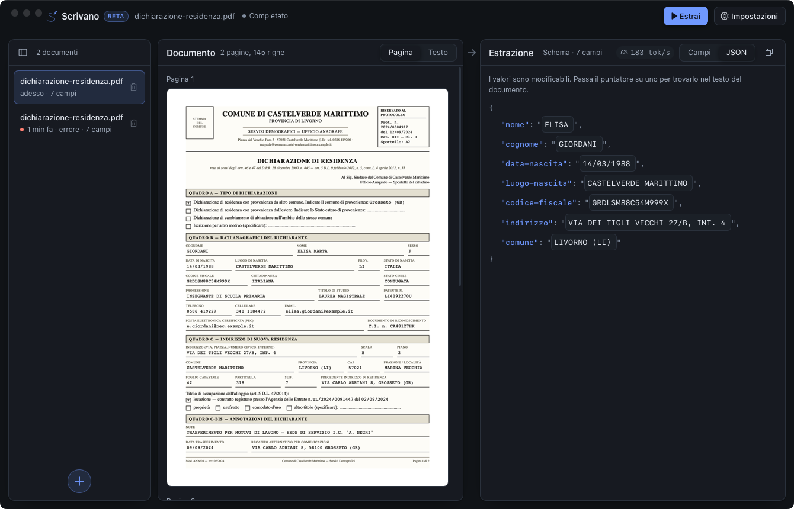

## Introduction

Document AI usually means a photo of a form goes to a server, a large model reads it, and structured
data comes back. It works, but the document — often the most sensitive thing a person owns — has left
the machine. I wanted the opposite: point at a scanned Italian form, say which fields I want, and get
JSON out **without anything leaving the laptop**.

That is [**Scrivano**](https://github.com/andreagemelli/scrivano) 📝 — a desktop app for key
information extraction (KIE) from Italian forms, running fully offline on a CPU. No API key, no
network, ~280 MB installed. The model that does the reading is 350M parameters, fine-tuned for the
job, and ships *inside* the app at 219 MiB.

*The app with the sample residency declaration loaded: fields on the left, streamed JSON on the right.*

Everything is open: [app and code](https://github.com/andreagemelli/scrivano),
[model](https://huggingface.co/andreagemelli/LFM2.5-350M-IT-Extract),
[GGUF](https://huggingface.co/andreagemelli/LFM2.5-350M-IT-Extract-GGUF) and
[dataset](https://huggingface.co/datasets/andreagemelli/xfund-kie-it) are on GitHub and Hugging Face 🤗

## How it works

The flow is deliberately boring, which is the point:

- **Read the page.** It accepts `pdf png jpg jpeg webp tif tiff`. PDFs render at 200 DPI; a page's
  own text layer is used when it yields more than 50 characters, otherwise it falls back to OCR
  (PP-OCRv5 + Latin recognition[^1], all Rust/ONNX, no Python at runtime).
- **You declare the fields.** Each field is a `key` + a natural-language `description`. New documents
  start from a 7-field preset, because the model was fine-tuned on prompts averaging seven fields.
- **The model extracts.** It streams the JSON, points each value back to where it sits on the page on
  hover, and flags values that appear *nowhere* on the page as likely inventions. Decoding is
  configurable; temperature is 0 by default.

One honest caveat baked into the design: the published accuracy assumes the model is told which
fields the document actually contains — *you* supply that by keeping the schema tight. This is a 350M
model. Read the output, don't trust it.

## The model

The brain is [**LFM2.5-350M-IT-Extract**](https://huggingface.co/andreagemelli/LFM2.5-350M-IT-Extract):
[`LiquidAI/LFM2.5-350M`](https://huggingface.co/LiquidAI/LFM2.5-350M)[^2] fine-tuned with SFT (TRL[^3])
to take a document's text plus a field schema and emit a JSON object, omitting fields it can't find.
For the app it is quantised to Q4_K_M — that is the 219 MiB [GGUF](https://huggingface.co/andreagemelli/LFM2.5-350M-IT-Extract-GGUF)
that gets bundled and never phones home.

Picking a 350M base was the whole game: small enough to ship inside an installer and run on a CPU,
big enough to learn the *shape* of the task. As with a lot of small-model work, the model isn't
learning to read Italian — it's learning to be disciplined: find the value, put it under the right
key, close the brace.

## The dataset

There was no off-the-shelf Italian KIE dataset shaped like this, so I built one:
[**xfund-kie-it**](https://huggingface.co/datasets/andreagemelli/xfund-kie-it), a conversion of the
Italian split of **XFUND**[^4] (a multilingual form-understanding benchmark) into a
schema-to-JSON extraction task.

The conversion pipeline starts from 4,882 question→answer links in the Italian XFUND split, maps
labels to a controlled set of keys (2,757 survive, 56%), then drops multi-answer labels and
conflicting duplicate keys. What comes out is **199 documents, 1,461 fields,
37 extraction keys** with natural-language descriptions — things like `codice-fiscale`,
`nome-completo`, `data-nascita`, `iban` — split **149 train / 50 validation**.

Small, and I won't pretend otherwise: 149 training documents is a first pass, and it shows.

## Does the fine-tune work?

Measured on the 50-document Italian validation split, greedy decoding:

| Model | Avg F1 | JSON parse failures |
|---|---|---|
| `LiquidAI/LFM2.5-350M` (base) | 0.2877 | 6 / 50 |
| **`LFM2.5-350M-IT-Extract`** | **0.6639** | 10 / 50 |
| same, Q4_K_M GGUF | 0.6635 | 10 / 50 |
| same, Q4_K_M on the app's own OCR text | 0.5662 | 10 / 50 |

Three things fall out of this table:

- **Fine-tuning more than doubles F1** (0.29 → 0.66) on 149 documents.
- **Quantising to Q4_K_M is essentially free** (0.6639 → 0.6635) — the thing you actually ship is
  the thing you measured.
- **OCR costs about 0.10 F1.** The clean-text number is what the model can do; the ~0.57 is what you
  get end-to-end once the pixels have to become text first.

And the part I insisted on in the README: these are **upper bounds**. The schema is oracle-filtered,
parse failures are excluded rather than scored zero, and the metric double-counts a wrong value.
Everything is reproducible with `uv run main.py`.

## Shortcomings

It's a beta, and the honest list is short:

- First fine-tune on 149 documents → **very sensitive to the schema descriptions**. Edit those
  before blaming the document, and prefer the presets.
- Only **single-page Italian** extraction is tested.
- **JSON isn't guaranteed** — 10/50 outputs didn't parse strictly; the app recovers key/value pairs
  from truncated output rather than crashing.
- A right-looking value under the *wrong* key isn't flagged.
- macOS builds are unsigned (clear the quarantine once); history is capped at 50 documents.

## Conclusions 🎁

Scrivano is small on purpose. The interesting claim isn't the F1 — it's that a *useful* document
extractor now fits in 219 MiB, runs on a CPU, and never sends your form anywhere. Three take-homes:

1. **Offline is a feature, not a downgrade.** For documents especially, "it never leaves the laptop"
   is worth more than a few F1 points from a hosted giant.
2. **Small models learn the shape, not the knowledge.** The model doesn't know Italian tax law; it
   learned to find a value and put it under the right key. The OCR and the schema do the rest.
3. **Report upper bounds honestly.** Oracle schema, excluded parse failures, a generous metric — say
   so, or the number lies for you.

Next on the list: more fine-tuning data, checking multilinguality still holds (Italian stays the
focus), a PII pipeline, and document classification.

If you want to point it at your own forms, grab a build from the
[releases](https://github.com/andreagemelli/scrivano/releases/latest) 📝

Happy extracting 🤗

## References

[^1]: PaddlePaddle, ["PP-OCRv5"](https://github.com/PaddlePaddle/PaddleOCR), PaddleOCR, 2025
[^2]: Liquid AI, [*LFM2 Technical Report*](https://arxiv.org/pdf/2511.23404), 2025
[^3]: Hugging Face, [*TRL: Transformer Reinforcement Learning*](https://github.com/huggingface/trl)
[^4]: Xu, et al., "XFUND: A Benchmark Dataset for Multilingual Visually Rich Form Understanding", [Findings of ACL 2022](https://aclanthology.org/2022.findings-acl.253/)
