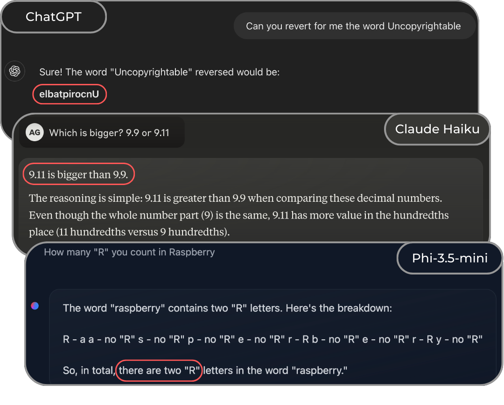
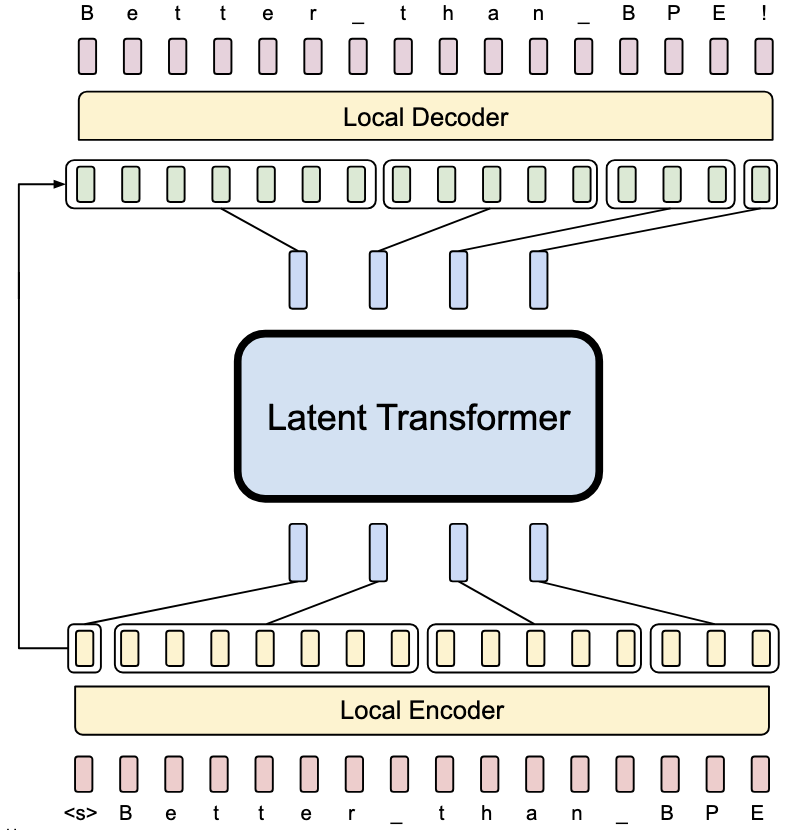

## Introduction

When working with Large Language Models, we often focus on their remarkable capabilities - from writing code to explaining complex concepts. However, there's a crucial component that can significantly impact their behavior and performance: tokenization 🍣.

As highlighted in a recent work by Garreth Lee and the Hugging Face team 🤗 [^0], even state-of-the-art models can stumble on seemingly simple tasks due to tokenization choices. For instance, many models struggle with the basic question "Which is bigger? 9.9 or 9.11" - a failure that showcase their limitations in understanding how numbers are tokenized and represented internally.


*ChatGPT, Claude and Phi struggling with simple questions.*

Unfortunately, sometimes models are not just *struggling*. Consider the infamous case of [SolidGoldMagikarp](https://www.lesswrong.com/posts/aPeJE8bSo6rAFoLqg/solidgoldmagikarp-plus-prompt-generation) - a string that, when input to the first ChatGPT, it could cause the model to produce nonsensical - or even harmful - outputs. This wasn't a failure of the model's understanding *per se*, but rather a reflection of an undertrained embedding vector accidentaly ended up in the vocabulary, consequently to the tokenization applied.

In these notes, I am going to review how tokenization works and which tokenizer library are available, to make informative decisions when developing language models.

## What are Tokenizers?

As humans, we are born with an innate ability to acquire language and to understand its structure, which provides a blueprint for learning *any* language and generate new sentences to express ourselfs [^3].
Unfortunately, language *"as it is"* cannot be digested by any architecture - just as images are processed as pixel values through neural networks! Tokenizers are the tools that implement a tokenization strategy, allowing to chunk the text into tokens and mapping each one into integers. Specifically:

- **Tokenization** is the process of translating text into sequences of tokens - and vice versa - that produces a map between text and numbers;
- **Tokens** are what Karpathy calls the "atoms of Transformers" [^2], i.e. the fundamental blocks that build language models and make them able to generate meaningful words and sentences.

Although the definitions are quite clear, the implementation of a tokenizer is far from simple. The strategy choice for tokens formation and vocabulary selection, will critically impact input encodings, model comprehension, and text generation capabilities.

### Embedding the Text

First of all, we need numbers and vectors to plug text into transformers and LLMs. How do we do so? 🤔

The naive solution would be to convert every character (letters, spaces, digits, symbols, emojis, etc.) into a unique integer. Following Python documentation, "strings are immutable sequences of Unicode code points", where Unicode is a standard definition of roughly 150k characters and 160 scripts, constantly evolving (UTF-8 preferred as described in this [manifesto](http://utf8everywhere.org)). In Python we can check the unicode of a character using the `ord()` function:

```python
print(ord("A"))
>> 65
```

For a simple string as `"I love coding in Python ❤️"` a character by character tokenization would result in a vector of 25 characters:

```python
def encode(text):
   return [ord(char) for char in text]

print(encode("I love coding in Python ❤️"))
>> [73, 32, 108, 111, 118, 101, 32, 99, 111, 100, 105, 110, 103, 32, 105, 110, 32, 80, 121, 116, 104, 111, 110, 32, 10084, 65039]
```

Great! We have our first encoding, but.. does this scale well? The answer is unfortunately no 🫠

Transformer architectures are very high demanding architectures, being their inner product complexity `O(N^2)`. This means that the computational cost of the model grows quadratically with the sequence length, suggesting that compressed inputs:

- would be more computationally efficient;
- would include more text and context.
  
This is where tokenizers come in.
From the [transformers library](https://huggingface.co/docs/transformers/index) we can import thousands of different tokenizers.
For example, let's use the tokenizer of the well known DeepSeek-R1[^4] architecture. The previous sentence would be transformed in:

```python
from transformers import AutoTokenizer
tokenizer = AutoTokenizer.from_pretrained("deepseek-ai/DeepSeek-R1")

def encode(text):
   return tokenizer.encode(text)

print(encode("I love coding in Python ❤️"))
>> [0, 43, 3518, 20255, 295, 15255, 53341, 100, 10759]
```

We could reduced to 6 tokens the same sentence as before, cutting out 80% of its previous lenght!

Looking at [its vocabulary](https://huggingface.co/deepseek-ai/DeepSeek-R1/raw/main/tokenizer.json), we can find out that:

- `0` is a special token that marks the beginning of sentence `<｜begin▁of▁sentence｜>`. 1 and 2 are reserved for the end of sentence and padding tokens, respectively.
- `43, 3518, 20255, 295, 15255` encode the sentence word by word;
- `53341, 100, 10759` are used for the emoji.

Without looking at the file, you can directly decode the text from the list of integers:

```python
tokenizer.decode([0, 43, 3518, 20255, 295, 15255, 53341, 100, 10759])
>> "I love coding in Python ❤️"
```

But who decides which tokens and numbers? Tokenization, of course!

### Existing Algorithms and Libraries

There are several algorithms which split text into tokens and create a vocabulary.
Among others, the most famous are:

1. **Byte Pair Encoding** [^5] (BPE), iteratively merges frequent character pairs to build a vocabulary, starting from a base one of 256. It has been largely popularized by GPT [^6] and more recently adopted by Llama3 [^7] and DeepSeek, to name a few;
2. **WordPiece** [^8] [^9]  follows a similar approach to BPE but uses likelihood rather than frequency to select the merges. The vocabulary is optimized to maximize the informative aspect of the merges, not simply compressing the entire input text;
3. **Unigram** (PAPER CITATION) uses probabilistic sampling to optimize a subword vocabulary by maximizing the likelihood of the training data.

If you want to look more into the details of these approaches, the [tokenizer summary](https://huggingface.co/docs/transformers/tokenizer_summary) made by HuggingFace it is perfect!

Luckly, there are already open-source library that help you use the cited approaches without reimplementing them from scratch.
The ones that I know, have used and suggests are the following:

- **Tokenizers** (from HuggingFace 🤗, [link](https://github.com/huggingface/tokenizers))
  - highly customizable and trainable
  - Implements BPE, WordPiece and Unigram!
- **sentencepiece** (from Google, [link](https://github.com/google/sentencepiece))
  - It can do both training and inference
  - It supports BPE and Unigram!
- **tiktoken** (from OpenAI, [link](https://github.com/openai/tiktoken/tree/main))
  - implements a fast BPE (3-6x faster than huggingface tokenizer)
  - simpler compared to sentencepiece, but it allows only inference!
- **MinBPE** (from Karpathy ❤️, [link](https://github.com/karpathy/minbpe))
  - Unlike tiktoken, this code allows you to train your own BPE tokenizer.
  - Training the RegexTokenizer on a large dataset (~100K), you would reproduce the GPT-4 tokenizer.

### Beyond traditional tokenizers

Recently a new paper from Meta led the foundations for a new adaptive approach beyhond traditional tokenizers: The Byte Latent Transformer (BLT) [^1].

Instead of using predefined tokens, it proposes to dynamically groups bytes into patches based on their information content. Citing the paper, "patches are segmented dynamically based on the entropy of the next byte, allocating more compute and model capacity where there is more data complexity". This approach shows promising results, with an efficiency gains of up to 50% and "improved robustness of BLT models to input noise and their awareness of sub-word aspects of input data that token-based llms miss".


*BLT architecture.*

As shown in the image, two lightweight local encoder / decoder are employed to transform bytes into patches dynamically, bypassing the need of a pre-trained fixed vocabulary. Than, the transformer architectures learns to predict the next *patch* given the input context directly within this embedded space.

An [offial repository](https://github.com/facebookresearch/blt) is already out, but to see its application at scale we still have to wait!

## Conclusions

Language models capabilities are boundend to, if not limited by, their plugged in tokenizers.
The choice of the tokenization strategy and vocabulary size is as important as pre-training and allignment techinques. Key takeaways include:

- Misbeahviours on corner cases are usually highly due to tokenization;
- General tokenizers may require adjustments on specific downstream tasks to improve model capabilities, such as in math [^0];
- The vocabulary size should be carefully chosen w.r.t. model training dimension to avoid under-trained tokens;
- Non-English languages may share common tokens with english, but special tokens should be added to consider multi-language applications [^7];
- Emerging approaches like BLT suggests we might move soon beyond traditional tokenization;

As we continue to improve language models, tokenization remains a critical area for innovation
The recent success of approaches like BLT's dynamic patching suggests that moving beyond fixed pre-trained vocabularies might be the key to build more efficient and capable models.

## References

[^0]: Lee, et al., "From Digits to Decisions: How Tokenization Impacts Arithmetic in LLMs", 2024.
[^1]: Pagnoni, et al, "Byte Latent Transformer: Patches Scale Better Than Tokens", 2024
[^2]: Andrej Karphaty, ["Let's build the GPT Tokenizer"](https://www.youtube.com/watch?v=zduSFxRajkE), 2023
[^3]: Chomsky, N, *"Aspects of the Theory of Syntax"*, 1965
[^4]: DeepSeek-AI, *"DeepSeek-R1: Incentivizing Reasoning Capability in LLMs via Reinforcement Learning"*, [GitHub](https://github.com/deepseek-ai/DeepSeek-R1/blob/main/DeepSeek_R1.pdf), 2025
[^5]: Sennrich, et al., *"Neural Machine Translation of Rare Words with Subword Units"*, 2015
[^6]: Radford, et al., *"Language Models are Unsupervised Multitask Learners"*, 2019
[^7]: Meta AI, *"The Llama 3 Herd of Models"*, 2024
[^8]: Yonghui Wu et al., *"Google’s neural machine translation system: Bridging the gap between human and machine translation."*, 2016
[^9]: Devlin et al., *"BERT: Pre-training of Deep Bidirectional Transformers for Language Understanding"*, 2019
